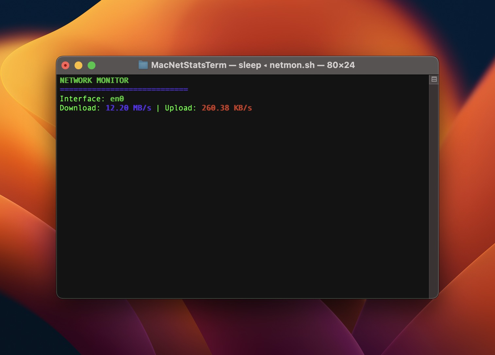

# MacNetStatsTerm

A small, interactive macOS terminal dashboard for the active network interface. It reads the system's cumulative byte counters once per second and displays current download and upload throughput without making network requests or leaving output in terminal scrollback.



## What it does

- Detects the interface used by the local default route.
- Samples macOS `netstat` receive and transmit byte counters every second.
- Calculates counter deltas and formats them as KB/s or MB/s.
- Uses the terminal's alternate screen buffer and restores the cursor on exit.
- Clamps a counter reset to `0.00 KB/s` instead of displaying negative throughput.
- Supports an explicit interface override for VPNs, bridges, and multi-interface Macs.

This is an interface-level monitor, not a per-process traffic inspector, packet capture tool, or historical bandwidth recorder.

## Requirements

- macOS with `/bin/bash` 3.2 or newer.
- An interactive terminal with alternate-screen support.
- The macOS system utilities `route`, `netstat`, `awk`, `tput`, and `sleep` available on `PATH`.

No package manager or third-party runtime is required. The script is macOS-specific because its `route` and `netstat` parsing follows the macOS command output.

## Install and run

```bash
git clone https://github.com/okturan/MacNetStatsTerm.git
cd MacNetStatsTerm
./netmon.sh
```

The repository tracks `netmon.sh` as executable. Press <kbd>Control</kbd>+<kbd>C</kbd> to stop; the original terminal screen and cursor are restored.

### Select an interface explicitly

Automatic detection uses the local default route. To monitor another interface:

```bash
NETMON_INTERFACE=en1 ./netmon.sh
```

Common interface names include `en0`, `en1`, and VPN interfaces such as `utun0`. List interfaces and their counters with:

```bash
netstat -ib
```

If default-route detection fails, the script warns and falls back to `en0`. Override that fallback without forcing the interface on every healthy run:

```bash
NETMON_FALLBACK_INTERFACE=en1 ./netmon.sh
```

## How throughput is calculated

For each direction, the monitor computes:

```text
(current byte counter - previous byte counter) / 1024 / sample interval
```

Rates below 1024 KB/s are shown in KB/s; rates at or above that threshold are shown in MB/s. Counters are cumulative for the selected interface, so the display covers all traffic on that interface during the sample window.

## Troubleshooting

### `missing required command(s)`

The startup check lists every unavailable system command. Confirm `/usr/bin`, `/bin`, `/usr/sbin`, and `/sbin` are present on `PATH`; a heavily restricted shell environment can hide tools that macOS normally provides.

### The wrong interface is selected

Run `route -n get default` and inspect the `interface:` row, or use `NETMON_INTERFACE` as shown above. VPN software can intentionally replace the default route.

### `could not read byte counters`

Confirm the interface still exists with `netstat -ib`. Interfaces may disappear when Wi-Fi, Ethernet, a hotspot, or a VPN disconnects. Restart the monitor after choosing an active interface.

### Terminal content or cursor looks wrong after interruption

Normal `INT`, `TERM`, and shell-exit paths restore the cursor and leave the alternate screen. If the process is killed with `SIGKILL`, the shell cannot run cleanup; `reset` restores most terminal state.

## Verification

The deterministic checks source the script without starting its infinite UI loop. They cover rate scaling, counter deltas and resets, interface detection and fallback, dependency failures, and the non-interactive execution guard.

```bash
bash -n netmon.sh tests/netmon_test.sh
shellcheck netmon.sh tests/netmon_test.sh
bash tests/netmon_test.sh
```

GitHub Actions runs ShellCheck on Ubuntu and the Bash 3.2 syntax and behavior-test gates on macOS. The workflow has read-only repository permissions and pins third-party actions to immutable commit SHAs.
